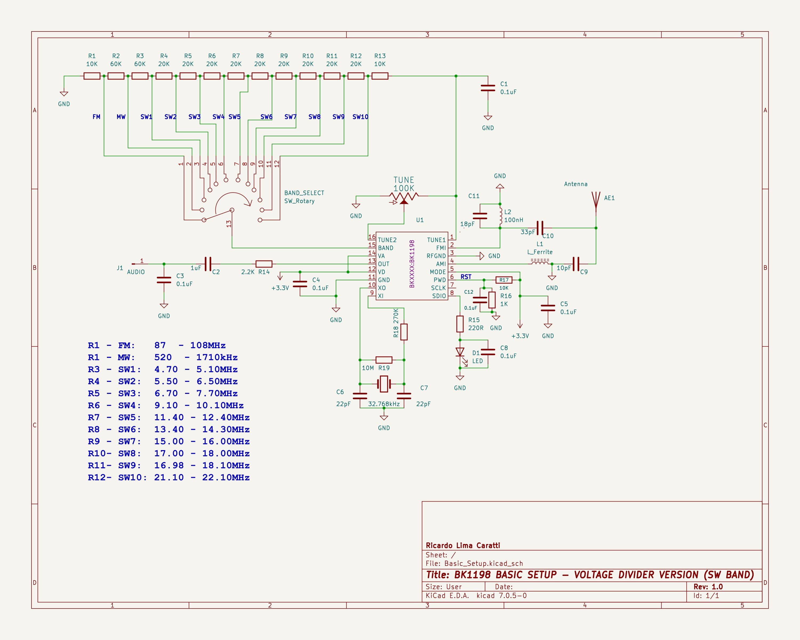

# BK1198 Arduino Libraty

UNDER CONSTRUCTION...

# [PU2CLR BK1198 Arduino Library](https://pu2clr.github.io/BK1198/)

The BK1198 is a single-chip solution for receiving AM, FM, and shortwave radio. 
Using inexpensive components (Arduino Pro Mini, some push buttons buttons, and a standard OLED or TFT display), the  hobbyists can build serviceable little receiver based on BK1198 with a impressive performance.  

This project involves a cross-platform Arduino Library designed to control the BK1198 device. The NK108X Aerduino Library library is based on the documentation titled "BK1198 BROADCAST AM/FM/SW/LW RADIO RECEIVER; Rev.1.4" provided by BEKEN Corporation. Its purpose is to enable seamless control and integration of the BK1198 device within Arduino projects.

This library can be freely distributed using the MIT Free Software model. 

[Copyright (c) 2020 Ricardo Lima Caratti](https://pu2clr.github.io/BK1198/#mit-license). 

Contact: __pu2clr@gmail.com__.