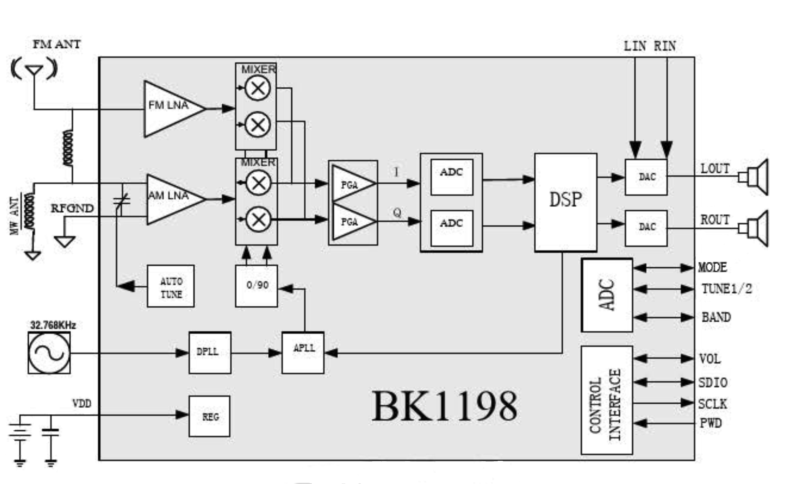

# BK1198 Arduino Libraty

The BK1198 is a highly integrated digital signal processor (DSP) designed for AM/FM radio reception. Manufactured by Beken Corporation, it is a cost-effective solution commonly used in low-cost consumer radios, offering excellent performance with minimal external components. The BK1198 provides a simplified design for manufacturers while delivering high-quality audio reception across various radio bands.
One of the standout features of the BK1198 is its digital interface, which allows seamless communication with microcontrollers via the I2C protocol. This enables developers to control the radio’s settings programmatically, offering flexibility for custom applications.

## Integration with Arduino or Other Microcontrollers:

The BK1198 operates as an I2C slave device, making it simple to interface with microcontrollers like Arduino, ESP32, or Raspberry Pi.
Through I2C, the microcontroller can adjust frequencies, switch bands (AM/FM), control audio output, and manage other radio parameters.
Customization and Automation: This digital control capability makes the BK1198 suitable for DIY radio projects, automated scanning, or integration into larger systems requiring radio functionality.

This project is about an Arduino library for the BK1168 and is still under development, therefore not yet functional. At the moment, the author of this project has not obtained the necessary documentation to program the BK1198. The attempts to advance the project have been based on the author's experience with the BK1088.

UNDER CONSTRUCTION...

